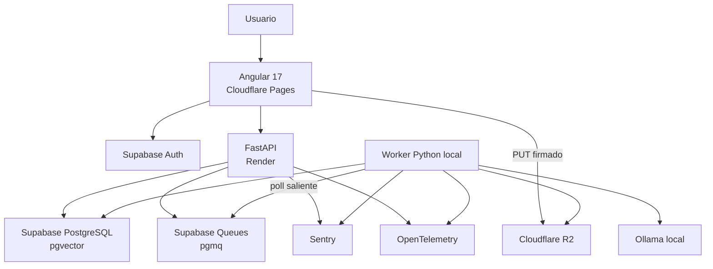
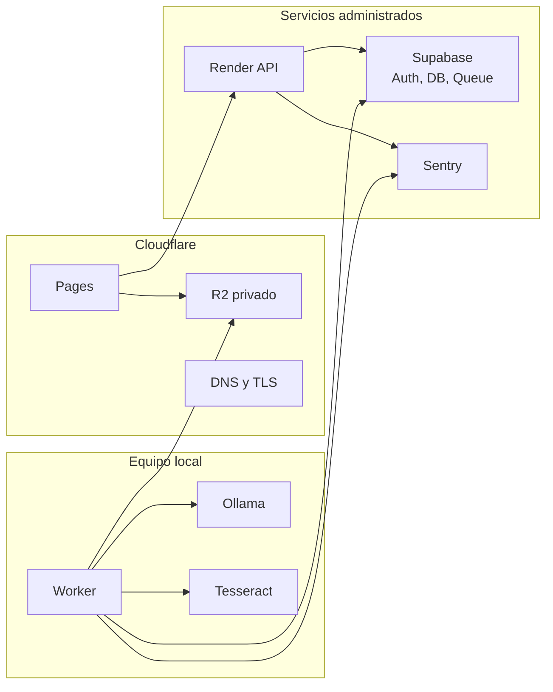
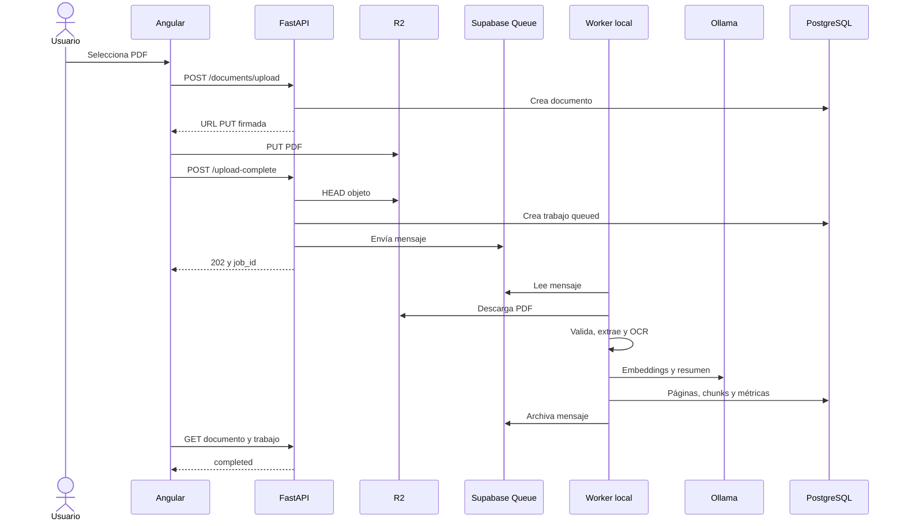
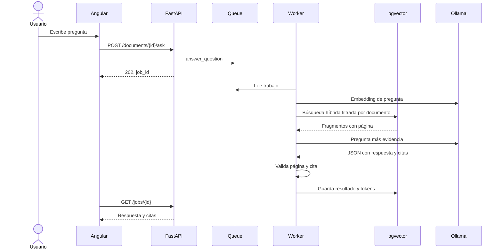
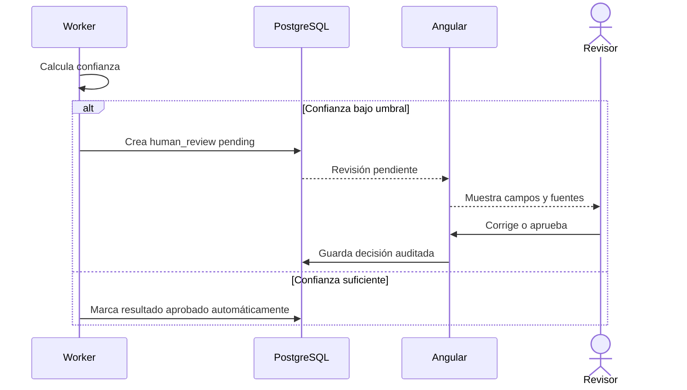
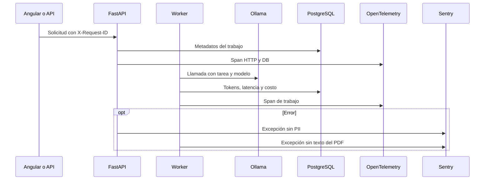
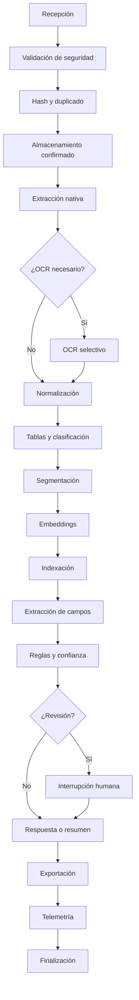
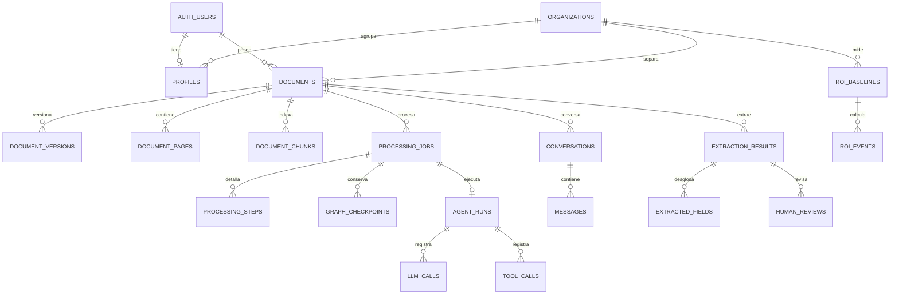

# Arquitectura

## Vista general

## Despliegue

El worker no acepta tráfico entrante. Todas sus conexiones salen hacia servicios HTTPS. Ollama escucha en `localhost`.

## Secuencia de carga y procesamiento

## Secuencia de una pregunta

## Revisión humana, piloto

## Telemetría

## Flujo LangGraph

El grafo ejecutable enruta cuatro clases de trabajo. El procesamiento documental registra checkpoints por etapa. El diseño de evolución conserva todos los nodos solicitados.

### Estado compartido

| Campo | Uso |
| --- | --- |
| `job_id` | Idempotencia, estado, cancelación y trazabilidad |
| `document_id` | Filtro obligatorio de documento |
| `owner_id` | Aislamiento de propietario |
| `task_type` | Ruta del grafo |
| `agent_run_id` | Correlación de preguntas y extracción |
| `payload` | Entrada validada de la tarea |
| `result` | Salida persistida |

### Resiliencia

- Cada nodo relevante actualiza `processing_jobs` y `graph_checkpoints`.
- `cancel_requested` se revisa antes de avanzar.
- El mensaje permanece invisible durante 3.600 segundos.
- Un fallo transitorio deja el mensaje en la cola para reintento.
- El tercer fallo envía una copia a `document_jobs_dlq` y archiva el original.
- Un trabajo `completed` o `cancelled` se archiva sin repetir efectos.
- La reindexación elimina e inserta páginas y chunks bajo el mismo documento.

## Modelo entidad relación

El archivo `database/migrations/0001_initial.sql` crea 33 tablas, índices HNSW, búsqueda textual, RLS y funciones RPC del RAG.

## Límites del MVP

- Un worker local activo define la capacidad de procesamiento.
- Si el worker permanece apagado, la cola crece sin perder mensajes.
- Ollama y OCR consumen CPU, RAM y VRAM del equipo local.
- La consulta usa polling desde Angular. SSE está expuesto en la API para una evolución.
- El frontend implementa funciones de usuario. Administración y revisión humana quedan para el piloto.

## SLO inicial

| Indicador | Objetivo piloto |
| --- | --- |
| Disponibilidad API | 99,5% mensual |
| Metadatos API p95 | Menos de 700 ms, sin cold start |
| Creación de trabajo p95 | Menos de 1,5 s |
| Inicio de trabajo | Menos de 30 s con worker activo |
| Extracción nativa | Menos de 1 s por página p95 |
| OCR | Menos de 8 s por página p95 |
| Respuesta RAG | Menos de 20 s p95 en hardware local |
| Tasa de trabajos exitosos | Mayor o igual a 98% |

Valida estos valores con PDF reales y la red de Bogotá antes del piloto.

